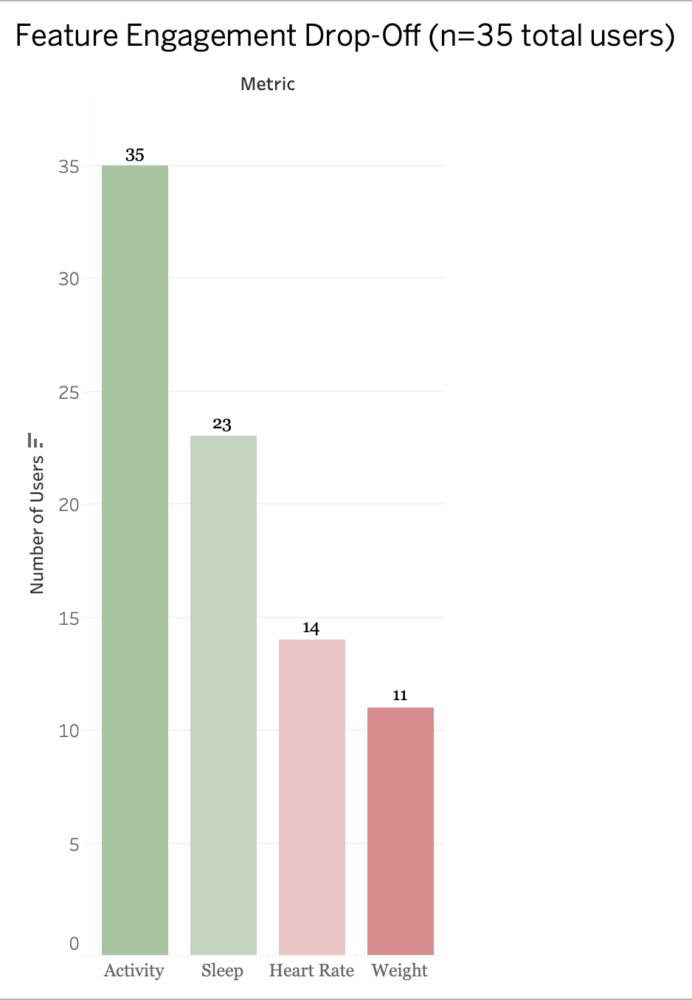
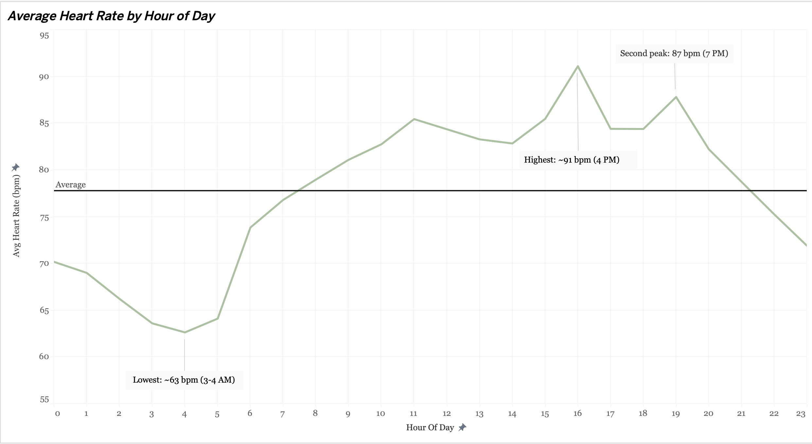
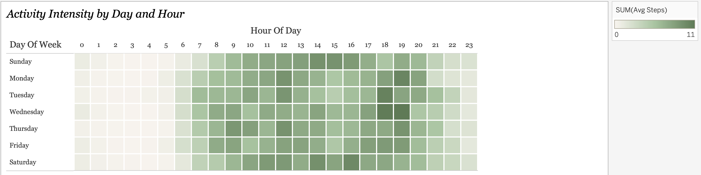
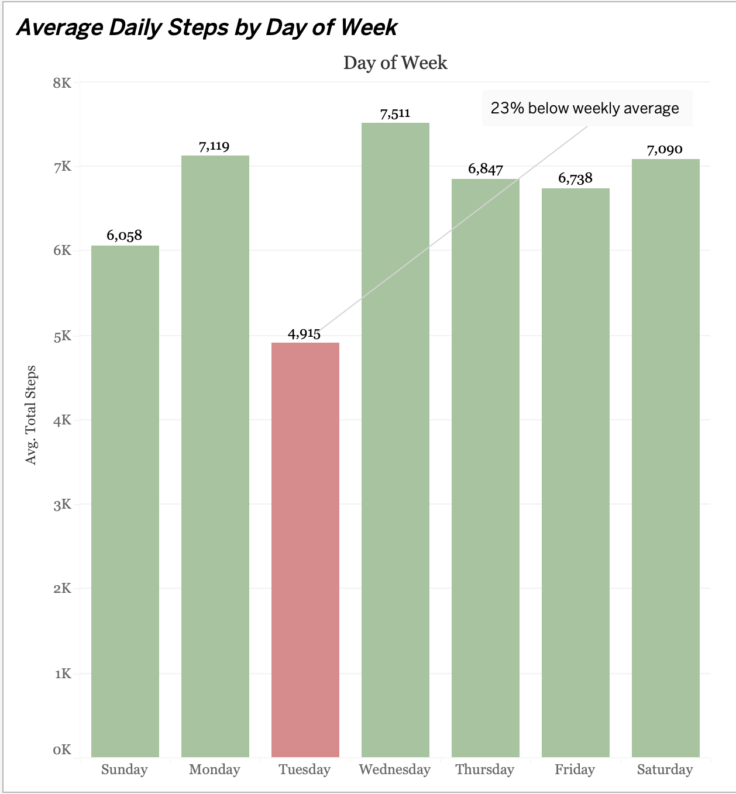
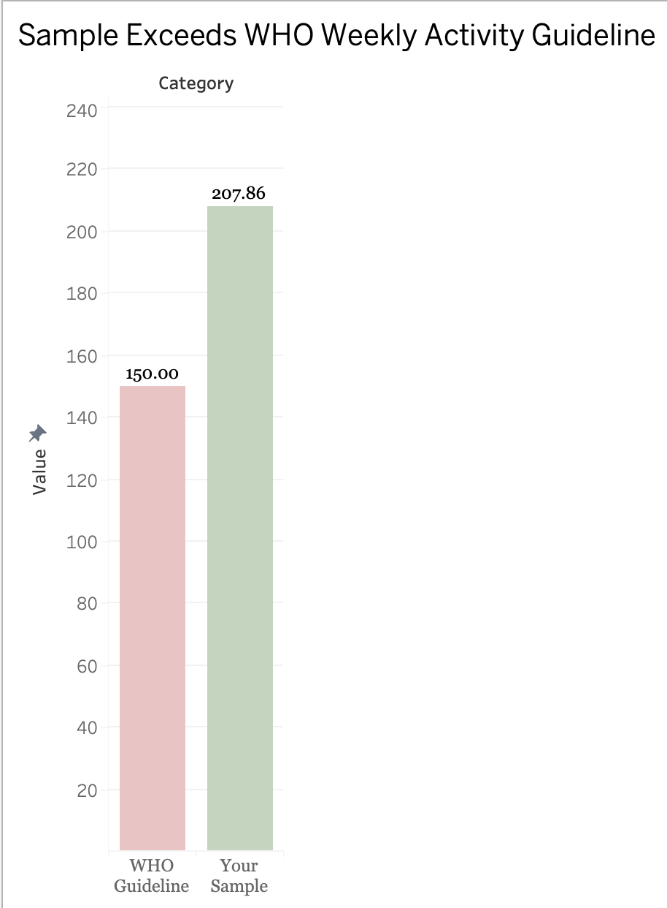
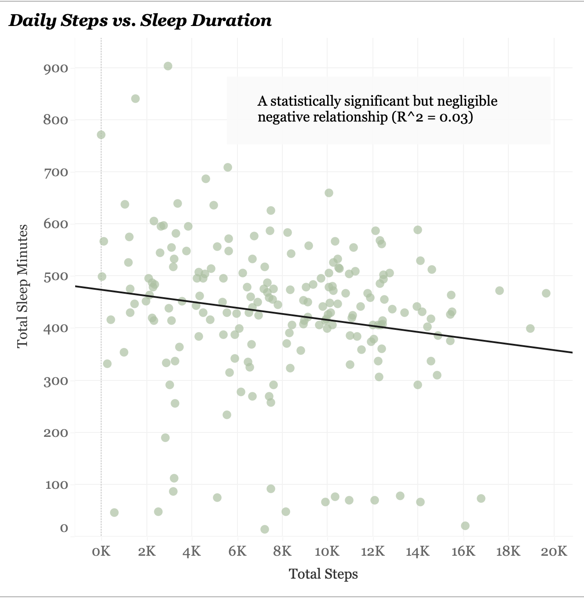
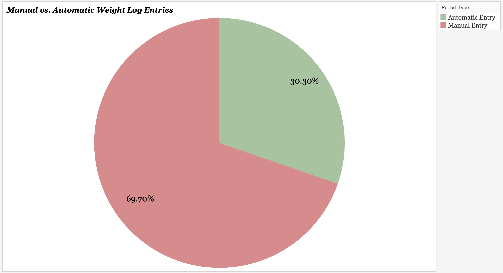

# Bellabeat: The Consistency Gap

A data analytics case study for Bellabeat, a high-tech manufacturer of health-focused smart products for women. This project analyzes how people actually use fitness trackers day-to-day, not just whether they're active, but which habits they track consistently and which ones they abandon, with the goal of uncovering concrete, testable opportunities for the Bellabeat app's engagement and retention strategy. The analysis moves from raw FitBit tracker data through SQL aggregation and interactive visualization to arrive at three specific, buildable product recommendations.

**[Dashboard](https://public.tableau.com/views/BellabeatVisualsCapstoneProject/BellabeatAppTheConsistencyGap?:language=en-US&:sid=&:redirect=auth&:display_count=n&:origin=viz_share_link)**

## Overview

Bellabeat's cofounder and Chief Product Officer (CPO), Urška Sršen, believes that analyzing smart device fitness data could unlock new growth opportunities for the company. She asked the marketing analytics team to study how consumers use non-Bellabeat smart devices, identify usage trends, and translate those trends into high-level recommendations for Bellabeat's marketing and product strategy, allowing her team the freedom to apply the findings to any one of Bellabeat's product lines (app, Leaf, Time, Spring, or membership).

This project analyzes public FitBit fitness tracker data, supplemented with WHO physical activity benchmarks, to answer that question. The central discovery: this is not a story about people being inactive; it is a story about **inconsistency**. People track some habits effortlessly and, on average, are more active than global health guidelines require, but engagement drops sharply depending on what they're asked to track and when. That distinction changes the entire shape of the recommendation: the opportunity is not to motivate a sedentary user base; it is to extend an already-strong habit (activity tracking) into the three habits that currently lag behind it (sleep, heart rate, and weight).

## Tools Used

- **Google Sheets**: initial data organization and descriptive statistics
- **SQL** (BigQuery): hourly and day-of-week aggregation across activity, heart rate, and intensity data
- **Tableau**: interactive dashboard and visualization

## Structure

This project follows the **Ask → Prepare → Process → Analyze → Share → Act** data analysis framework.

### Ask
Bellabeat asked three guiding questions: what are the trends in smart device usage, how could these trends apply to Bellabeat customers, and how could these trends help influence Bellabeat's marketing strategy? The business task was to analyze usage data from non-Bellabeat smart devices, since Bellabeat's own device data wasn't available for this study, and translate the findings into actionable recommendations the marketing and product teams could apply to a Bellabeat product. The key stakeholders are Urška Sršen (Chief Product Officer), Sando Mur (co-founder and mathematician), and the Bellabeat marketing analytics team.

### Prepare
Data came from two sources, chosen specifically to address each other's limitations:
- **[FitBit Fitness Tracker Data](https://www.kaggle.com/datasets/arashnic/fitbit)** (Kaggle, CC0: Public Domain, via Mobius): personal fitness tracker data from 35 FitBit users, including daily activity, heart rate, sleep, and weight logs. This is the primary dataset and the source of every finding in this project.
- **[World Health Organization (WHO) Global Health Observatory](https://www.who.int/data/gho/data/indicators/indicator-details/GHO/prevalence-of-insufficient-physical-activity-among-adults-aged-18-years-(age-standardized-estimate)-(-))**: global insufficient-physical-activity benchmark among adults, used purely as an external point of comparison.

The FitBit dataset has real limitations worth naming directly: it is s a small, self-selected sample (35 users) over a short window (~30 days), and it likely skews toward people already engaged enough with fitness tracking to volunteer their data for public research, which means findings may not generalize to a broader population. Rather than treating the dataset's numbers as absolute truths, the WHO benchmark was added specifically to test whether this sample's activity levels were reasonable when measured against an independent, globally recognized standard, instead of relying on the FitBit data to grade itself.

### Process
Data was downloaded, unzipped, and organized into clearly labeled `Raw Data` and `Working Data` subfolders to preserve an unmodified copy of the original files. Minute-level and hourly files (steps, intensity, heart rate, METs) were loaded into Google BigQuery, where SQL queries, which are visible in full in `bigquery_queries.sql`, aggregated the raw, high-frequency data into hour-of-day and day-of-week summary tables suitable for visualization. This step was necessary because the raw data (~250 MB across all metrics) is far too granular to chart directly; aggregating in SQL first, rather than in Tableau, kept the pipeline auditable and the final visualizations fast to load. Only the cleaned, aggregated summary tables are included in this repo; the full raw minute-level data is still available directly from the [Kaggle source](https://www.kaggle.com/datasets/arashnic/fitbit) linked above.

### Analyze
Analysis was structured around four specific questions rather than open-ended exploration: (1) how consistently do users track each of the four available metrics, (2) when during the day and week is activity highest and lowest, (3) how does this sample's overall activity level compare to the WHO's global guideline, and (4) does higher daily activity predict better sleep that night. The first three were answered through descriptive aggregation in BigQuery (counts, percentages, hourly/daily averages); the fourth required a linear regression between daily step count and total sleep minutes to test whether an apparent relationship was statistically meaningful or just noise.

### Share
Findings were visualized in Tableau, where I created seven charts in total, each isolating a specific finding rather than combining everything into a single dense dashboard, and compiled them into a final slide presentation for a non-technical executive audience. See Key Visuals & Findings below for a full breakdown of each chart, and `presentation/` for the complete slide deck.

### Act
The analysis converts into three specific, buildable recommendations (see below), each tied directly to one of the visualizations rather than presented as a generic suggestion. All three were designed to be things Bellabeat's product team could realistically ship and A/B test, not just strategic direction.

## Key Findings

- **Engagement drops off the harder a metric is to log**: Of 35 users, 100% tracked activity, 66% tracked sleep, 40% tracked heart rate, and only 31% tracked weight, and weight was also the metric requiring the most manual effort (69.7% of weight entries were entered by hand rather than synced automatically). The least-tracked metric is also the most effortful one, which points to a friction problem rather than a motivation problem.
- **Activity follows a predictable, exploitable rhythm**: Heart rate is lowest overnight (~63 bpm around 3–4 AM) and peaks around 4 PM (~91 bpm) and again around 7 PM (~87 bpm). Step counts remain fairly steady (6,000–7,500/day) except on Tuesdays, which average 23% fewer steps (4,915) than on other days.
- **This sample beats WHO activity guidelines, but activity and sleep are independent habits**: Average weekly active minutes (207.86) came in 38% above the WHO's 150-minute recommendation. However, step count explains only about 3% of the variation in sleep duration (R² = 0.03) — a statistically real but practically negligible relationship. Boosting activity shouldn't be assumed to improve sleep as well.

## Key Visuals & Findings

**Metric Tracking Consistency**: A bar chart with the four tracked metrics (Activity, Sleep, Heart Rate, Weight) along the x-axis and the number of the 35-user sample tracking each one along the y-axis, ordered from highest to lowest engagement. For example, we can see Activity at 35 users (100%), Sleep at 23 (66%), Heart Rate at 14 (40%), and Weight at 11 (31%). This chart is the anchor of the entire analysis: read alongside the finding that Weight is also the metric requiring the most manual effort (69.7% of entries entered by hand rather than auto-synced from a scale), the pattern becomes a specific, testable claim: engagement falls off in direct proportion to how much effort a metric demands, not because users stop caring. That reframes the business problem from "increase motivation" to "reduce friction," a far more solvable design challenge for a product team to act on.

**Heart Rate by Hour of Day**: A line chart with hour of day (0–23) along the x-axis and average heart rate (bpm) along the y-axis, built from the `bq_heartrate_hourly` summary table. The line dips to its lowest point overnight (~63 bpm at 3–4 AM), climbs through the morning, and forms two distinct peaks: a primary peak around 4 PM (~91 bpm) and a secondary peak around 7 PM (~87 bpm). This chart independently confirms the day's real activity windows using a completely different biological signal than step count; when two unrelated metrics point to the same afternoon/evening pattern, that agreement makes the finding far more trustworthy than either metric alone, and gives product and marketing teams a specific, evidence-backed window for when to prompt users toward activity.

**Weekly Activity Heatmap**: A heatmap with day of week along one axis and hour of day along the other, built from the `bq_activity_heatmap` and `activity_heatmap_results` tables. Each cell is shaded by average step intensity for that specific day-and-hour combination, with darker, more saturated cells indicating higher activity and lighter cells indicating lower activity. This is the most granular view in the dashboard, and it's precisely how the Tuesday dip (shown in the next chart) was first spotted; a simple day-of-week bar chart, averaged across all 24 hours, would have hidden this pattern, and only once hour-by-hour resolution was added did Tuesday's underperformance become visible, motivating a closer look at that day specifically.

**Average Daily Steps by Day of Week**: A bar chart with each day of the week along the x-axis and average total steps along the y-axis. Six days cluster between 6,058 and 7,511 steps tightly, while Tuesday stands out in red at just 4,915 steps, and this is flagged directly on the chart as 23% below the weekly average. This is the clearest, most immediately actionable finding in the entire project: it turns a vague observation ("people are less active sometimes") into a specific, dated, testable target. Since the drop is isolated to a single day rather than spread evenly across the week, it's a concrete opportunity Bellabeat can design around directly, such as testing a Tuesday-specific nudge and measuring whether it closes the gap.

**Activity vs. WHO Benchmark**: A two-bar comparison chart plotting the WHO's globally recommended minimum weekly active minutes (150) against this sample's actual average (207.86). The 38% gap above the benchmark reframes the entire narrative of the project; without this external reference point, "207.86 minutes" is just a number; it's the WHO comparison that proves this population isn't under-active, it is under-served by an app experience that never reflects back how well users are already doing. This chart is the direct visual justification for Recommendation #1 below.

**Activity vs. Sleep Duration**: A scatterplot with daily step count on the x-axis and that night's total sleep minutes on the y-axis, one point per user-day, with a regression line overlaid to show the overall trend. The line comes out nearly flat and is labeled directly on the chart as statistically significant but negligible (R² = 0.03). The flatness of that line is the entire point of the chart: it visually proves that activity level and sleep duration behave as two statistically independent habits in this data, a real relationship since it's not due to chance, but too small to be practically meaningful. This matters because it's easy to assume a feature boosting activity would also improve sleep; this chart is the evidence that prevents that incorrect assumption from steering product decisions, and signals that sleep needs its own dedicated intervention rather than piggybacking on activity features.

**Weight Logging (Manual vs. Automatic)**: A pie chart showing weight entries by logging method, broken down into two categories: automatic sync (30.30%) versus manual entry (69.70%). Paired with Weight's status as the least-tracked metric overall (only 31% of users, from the first chart above), this chart isolates why engagement is lowest here: it's not that users don't value tracking their weight; it's that the current logging method demands too much manual effort. This is the direct evidence behind Recommendation #3 below, and shows exactly where in the product experience that friction lives.

## Recommendations

1. **Show users their progress against a real benchmark**: Add an in-app "weekly progress" indicator (e.g., "112 of 150 minutes this week") tied to the WHO's 150-minute guideline. Users are already exceeding this benchmark on average, but nothing in the current experience reflects that back to them. Turning a number nobody sees into a visible, achievable goal reinforces a habit that's already working, using data the app already collects.

2. **Reminders to when people are actually active and target Tuesday dip specifically**: Schedule activity nudges around the two real peak windows (afternoon and evening) instead of generic, evenly spaced reminders, and add a Tuesday-specific nudge to counteract the midweek slump. A notification sent when someone is already inclined to move is more effective than one sent on an arbitrary schedule, and the Tuesday dip is a concrete, data-backed opportunity that's easy to A/B test directly.

3. **Reduce effort required to log weakest-performing metrics**: Prioritize lowering friction specifically for weight and sleep logging, for instance, having  smarter pairing prompts for connected scales, or a simplified one-tap sleep confirmation as opposed to spreading development effort evenly across all four metrics. Activity tracking already works well for the full sample; weight and sleep have the largest engagement gaps and therefore the most room to grow.

## Files

- `bigquery_queries.sql`: BigQuery aggregation queries (hourly heart rate, steps, intensity, METs, and combined activity heatmap)
- `data/`: cleaned source data (daily activity, weight logs, WHO benchmark)
- `data/summary/`: aggregated summary tables produced by the BigQuery queries above, used to build the Tableau dashboard
- `presentation/`: final presentation deck (PDF)
- `Bellabeat Visuals.twbx`: packaged Tableau workbook

## Author

Pratik Vindyala
